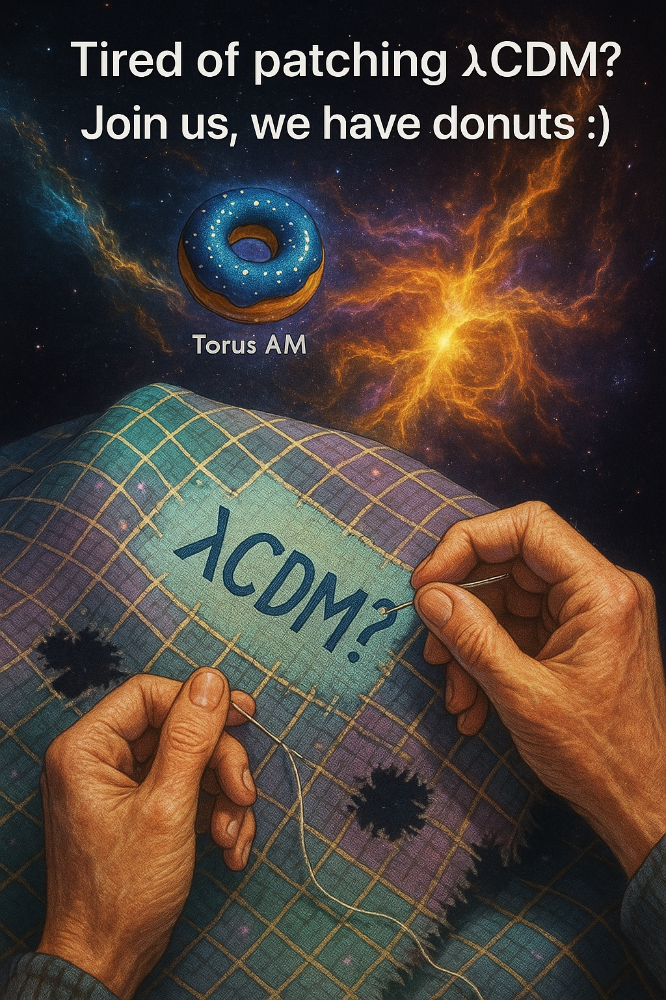

# GENESIS Cosmogenesis Framework

**DOI:** [10.5281/zenodo.15701148](https://doi.org/10.5281/zenodo.15701148)  
**Author:** Anna Maria Dębniak Sørensen  
**ORCID:** https://orcid.org/0009-0001-7263-8068  
**Repository:** [GitHub](https://github.com/AnnaMariaDebniakSorensen/GENESIS)  

---

## 🔭 What is GENESIS?

GENESIS is a falsifiable, UV-complete model of cosmogenesis where time and metric structure emerge from axial torsion.  
A signature flip replaces the singularity and seeds a causal manifold.  

Dark matter arises from frozen torsion solitons.  
Dark energy emerges as residual angular momentum.  
All predictions are observationally testable.

---

## 🔬 Key predictions:

- JWST: LRD objects and lensing profiles  
- EDGES: 21 cm cooling signature  
- LIGO/KAGRA: gravitational echoes (3–5 kHz)  
- Galaxy spins: primordial dipole  
- Signature dynamics encoded in geometry

---

## 🔗 Resources

- 📄 ### 📄 Download the full paper (PDF)

👉 [Click here to read GENESIS-10.pdf](GENESIS-10.pdf)

> *“GENESIS is not a bounce. Not a scalar. Not an approximation. It is the structure from which time begins.”*

  <h1>📣Tired of patching ΛCDM?</h1>

  
<strong>Dark matter</strong> – unknown. 
     <strong>Dark energy</strong> – artificial. 
     <strong>Inflation</strong> – untestable. 
     <strong>Singularity</strong> – a wall. 
     <strong>New particles</strong> – never detected.

  
📉The standard model of cosmology has become a patchwork quilt — torn, stitched, and stretched to explain what it cannot predict.

  
Each new observation — JWST, DESI, EDGES — forces another ad hoc fix.

  <h2>🌀Time to change the paradigm.</h2>

  
<strong>GENESIS</strong> is a new falsifiable cosmological model built on <strong>torsion geometry</strong>, with no singularities, no inflaton, and no hypothetical particles.

  
Instead: pure geometry, spin–torsion dynamics, and testable predictions:

  <ul>
    <li>Dark matter = topological torsion solitons</li>
    <li>Dark energy = residual angular momentum</li>
    <li>Baryogenesis = CP‑violating axial torsion</li>
    <li>Gravitational-wave echoes = 3–5 kHz</li>
    <li>DM halos from geometry — not SIDM</li>
    <li>21 cm anomaly? — torsion cools the early Universe</li>
  </ul>

  
🧠Transparent. Coherent. Falsifiable.

  
<strong>GENESIS</strong> also bridges <em>classical and quantum gravity</em>, 
  by promoting torsion to a dynamical, quantized field. 
  A geometric phase transition gives rise to spacetime itself.

  <h2>🍩Join GENESIS. We have donuts.</h2>

  
📄DOI: <a href="https://zenodo.org/records/15701148" target="_blank">https://zenodo.org/records/15701148</a> 
     🔜 arXiv release imminent

  

    #GENESISmodel #Torsion #QuantumGravity #Cosmogenesis #DarkMatter #TorusAM #PhysicsNeedsDonuts
  

</body>
</html>
