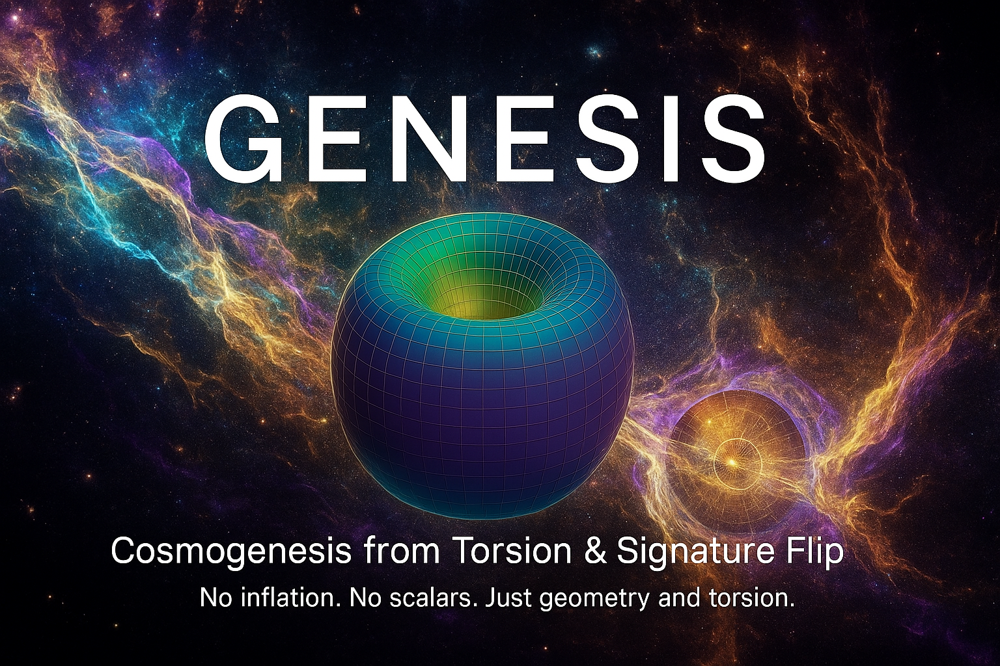

# GENESIS Cosmogenesis Framework

**DOI:** [10.5281/zenodo.15701148](https://doi.org/10.5281/zenodo.15701148)  
**Author:** Anna Maria Dębniak Sørensen  
**ORCID:** https://orcid.org/0009-0001-7263-8068  
**Repository:** [GitHub](https://github.com/AnnaMariaDebniakSorensen/GENESIS)  

---

## 🔭 What is GENESIS?

GENESIS is a falsifiable, UV-complete model of cosmogenesis where time and metric structure emerge from axial torsion.  
A signature flip replaces the singularity and seeds a causal manifold.  

Dark matter arises from frozen torsion solitons.  
Dark energy emerges as residual angular momentum.  
All predictions are observationally testable.

---

## 🔬 Key predictions:

- JWST: LRD objects and lensing profiles  
- EDGES: 21 cm cooling signature  
- LIGO/KAGRA: gravitational echoes (3–5 kHz)  
- Galaxy spins: primordial dipole  
- Signature dynamics encoded in geometry

---

## 🔗 Resources

- 📄 [Read GENESIS-9.pdf](../GENESIS-9.pdf)  
- 🧠 [Machine metadata (meta.yaml)](../GENESIS-meta.yaml)  
- 🧷 [Release notes](../release-notes.md)  
- 🧵 [Launch tweet](../tweet.txt)

---

> *“GENESIS is not a bounce. Not a scalar. Not an approximation. It is the structure from which time begins.”*
